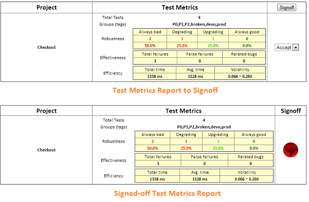

# Add New Test Case #

To add new test case, you can click the 'New' button on the Web Console's 'TestCase' tab, and input necessary information. Then by clicking the '*' column of the new case, you will see the generated code as follows:

* TestNG

		public class TestSomething {

			@Test(groups = { "group1", "group2" })
			@TestDoc(
				project = "project name", 
				name = "test case name", 
				description = "test case description")
			public void testSomething() {
				// test steps
			}
		}

* JUnit

		public class TestSomething extends TestSyncForJUnit {

			@TestDoc(
				project = "project name", 
				name = "test case name", 
				description = "test case description", 
				groups = { "group1", "group2" })
			@Test
			public void testSomething() throws Exception {
				// test steps
			}
		}

The values of *@TestDoc* depend on your provided when creating the case. Move the code to your automation project, and implement the test steps.

TestMP currently supports binding to TestNG or JUnit tests. For JUnit test, at least JUnit 4.9 is required. To bind automation test cases to TestMP, you need to put *lib/\*.jar* on the class path of your automation project. If you use Maven to build your automation, an alternate way is to add the dependency below:

	<dependency>
		<groupId>org.testmp</groupId>
		<artifactId>testsync</artifactId>
		<version>1.0.3</version>
	</dependency>

*Note: If you directly implement the test case in your automation project, and run it following the way below, it will also be automatically added to the Web Console.*

*Note: for TestMP v1.0.3, please download [testsync-1.0.3.jar](http://central.maven.org/maven2/org/testmp/testsync/1.0.3/testsync-1.0.3.jar) to replace lib/testsync-1.0.2.jar if you are going to add lib/\*.jar to the classpath.*

# Run Test Case #

Any updates of *@TestDoc* and the test result can be automatically synchronized to the Web Console. The only necessary step is passing the JVM arguments below when running test case:

Example:

	-DupdateTestDocument=true -DupdateTestMeasures=true -DtestmpAddr=192.168.12.34

* *updateTestDocument* - whether to automatically update the test document.
* *updateTestMeasures* - whether to automatically update the test measures.
* *runHistoryCapacity* - the maxium number of test run records that are kept.
* *testmpAddr* - the remote host running TestMP.
* *testCaseStoreAddr* - the remote address of test case store (host:port).
* *testDataStoreAddr* - the remote address of test data store (host:port).

All these arugments have default values:

* *updateTestDocument* and *updateTestMeasures* default to **false**.
* *runHistoryCapacity* defaults to **30**.
* *testmpAddr* defaults to **localhost**.
* TestMP infers *testCaseStoreAddr* and *testDataStoreAddr* from *testmpAddr*.

>You only need to specify *testmpAddr* when it's running remotely. If test case store and test data store are running not on the same host as TestMP, or not listening to the default ports, then you should specify *testCaseStoreAddr* and *testDataStoreAddr* respectively instead of *testmpAddr*.

After the first run from the automation code, you can also launch the test case directly from the Web Console, by clicking the '*' column of each record, or by clicking the 'Run' button on the Web Console's 'TestCase' tab.

Such convenience needs some pre-configurations - the automation service. It is a server that accepts query parameters *automation* and *action*.

* *action* - there're 3 actions: 'query', 'launch', and 'cancel'

* *automation* - a list of the full name of test cases separated by ',' to act on.

Each response should return a string composed of '0' and '1', corresponding to the sequence specified in the query parameter *automation*. '1' means the test case is running, '0' means the reverse.

You can implement your own automation service, but TestMP provides one which you can learn the usage by running the command:

	python3 $TESTMP_HOME/bin/automation_service.py -h

Example:

	python3 $TESTMP_HOME/bin/automation_service.py -c "command"

For TestNG, the command could be:

	java org.testng.TestNG -methods {a}

For JUnit, the command could be:

	java org.testmp.sync.junit.RunTest -methods {a} /* To be done */

*Note:*

1. *make sure the testng or testsync library and your automation project are in the class path.*

2. *{a} is a parameter holder to be populated by the automation service - the full name of test case (package.class.method)*

Finally, remember to set the automation service url in *conf/testmp.properties*, or in the Web Console's 'Settings' window.

# Evaluate Test Case #
Open the Web Console, and select the 'Test Case' tab. Clicking the 'Filter' button to filter out the test cases that will be included in the test metrics report. Then clicking the 'Report' button will generate the report waiting for signoff, and there are metrics for each project:

* *Total Tests* - the number of test cases from this project.
* *Groups (tags)* - the groups involved in this test.
* *Robustness* - the distribution of quality robustness evaluated from the run history.
* *Effectiveness* - the number of real bugs and the number of false alarmings.
* *Efficiency* - the test run time and its volatility.   

Mark each project as "Accept" or "Refuse" based on the metrics, and click the 'Signoff' button to get the final report. Now it's ready to send the report to the stakeholders. You can set the default settings of sending report in *conf/testmp.properties*, or on the Web Console's 'Settings' window.
