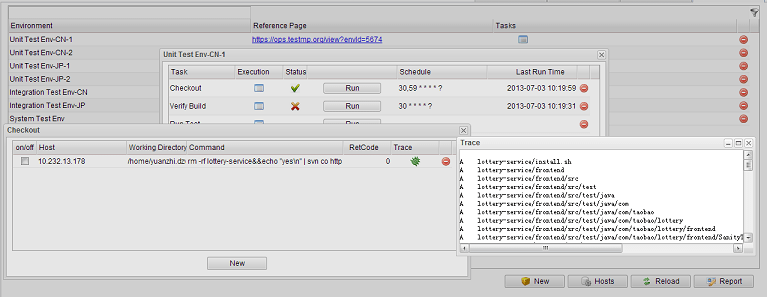
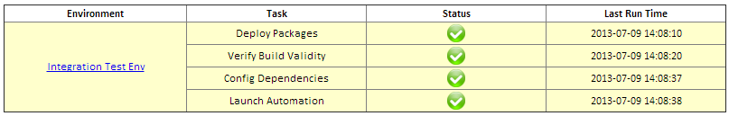

# Manage Test Environment #

Typically a test process involves several test environments at different stages including component (unit), integration, and production. And environment builds on one or more hosts.

You may have built or are going to create scripts to solve various environment-replated problems, like deploying packages, checking the build validity, configuring the environment, launching the automation, etc.

TestMP help you organize, schedule, visualize, and monitor these local / remote scripts, to facilitate the test environment & process management.

At first, there are some related terms:

* *Environment* - a concept about the hardware / software context in which the test is performed.
* *Host* - one or more devices that comprise the hardware part on which a test environment is built.
* *Task* - a concept about a group of executions on selected hosts belonging to an environment, usually with a certain purpose.
* *Execution* - a concept about a script / command running against a specified host, which will generate some results on the end.

Adding an environment to TestMP is intuitive: open the 'Test Environment' tab and click the 'New' button. Then input the environment's name and optionally give a url of the *reference page* on which the environment detail can be found.

Then you can define tasks for this environment: click the 'Tasks' icon of this environment record; on the pop-up window, click the 'New' button; Then input the task name, and optionally set the schedule if you hope it run repeatly and expectedly. The [schedule syntax](./schedule-syntax.txt) is unix-like but a little different.

	By default, the schedule will take effect at most in 600 seconds. You can configure it in the conf/testmp.properties.

A task can have multiple executions at the same time: click the *Executions* icon of the task record to open the window. Each execution has the following fields:

* *on/off* - enable or disable such execution.
* *Host* - the host on which the execution is expected to run.
* *Working Directory* - the current directory for the execution.
* *Command* - the actual command to be executed.
* *RetCode* - the returned code of the execution's last run.
* *Trace* - the output of the last execution, which can be refreshed if the last run is still in progress.

When adding a new execution record, by default, its *Host* will be set to "localhost", the host on which TestMP is running. If you want it to be another, you'll need to firstly register that host.

Click the 'Hosts' button on the "Test Environment" tab. For each added new host, the hostname, username, and password are required to setup the SSH connection.

	For connection failures, you may want to make sure the host administrator has enabled the "password" authentication method for its SSH configuration.

Besides scheduling the tasks, you can launch them at any time by clicking the 'Run' button of the task record.

By clicking the 'Report' button on the "Test Environment" tab, you will get a summary report about the status of all the test environments shown in list, just like below:

and you can send it as email to the people who are interested in this.