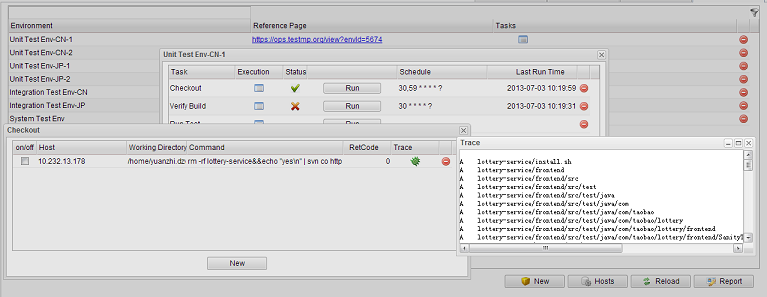
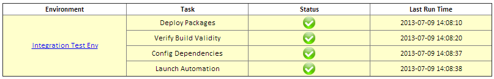

# Setup #
Once downloaded, unpack the compressed folder to see the structure of (the compiled) TestMP. You'll see a structure like this:

	testmp/
	|-- bin/      # contains the scripts for startup & maintenance.
	|-- conf/     # contains the configuration file.
	|-- data/     # contains the database files.
	|-- lib/      # contains the TestMP client libraries.
	|-- log/      # contains the generated log files.
	|-- webapp/   # contains the wars of WebConsole and DataStore.
    |-- README.md

It's not forced but recommended that you set the TESTMP_HOME environment variable, of which the value is the path to the *testmp/*, if you hope to launch TestMP outside such directory.

Before running TestMP, you also need to have Java Runtime Environment (Version 6 or the above) installed, and make sure the JAVA_HOME is set correctly.

# Configuration #
You will find most TestMP configurations in the *conf/testmp.properties*:

	# The locale setting of webconsole and reports
	locale=en_US

	# The launching url of the datastore each for test case, data, and environment.
	testCaseStoreUrl=http://localhost:10081/DataStore.do
	testDataStoreUrl=http://localhost:10082/DataStore.do
	testEnvStoreUrl=http://localhost:10083/DataStore.do

	# The number of threads for running tasks.
	executionThreadNum=10
	# The timeout of task execution. 0 means no timeout.
	executionTimeout=0

	# The time gap (in seconds) between two refreshings of the task schedule.
	scheduleRefreshingTimeGap=1800
	# The maximum latency (in seconds) to trigger a scheduled task, or ignore it.
	taskTriggerMaxLatency=600

	# The default recipient list and subject of the test metrics report. 
	testMetricsReportRecipients=
	testMetricsReportSubject=

	# The default recipient list and subject of the test env status report.
	envStatusReportRecipients=
	envStatusReportSubject=

	# The default SMTP settings to sending the report.
	smtpSettingHost=
	smtpSettingPort=25
	smtpSettingUser=
	smtpSettingPass=
	smtpSettingSTARTTLS=true

Currently TestMP supports UI languages of US English (the default) and Chinese. Change the *locale* to **zh_CN** if you want to change the language to Chinese.

While most of the other settings can be left to their default values, *testCaseStoreUrl*, *testDataStoreUrl*, *testEnvStoreUrl* may need to be modified if the default listening ports have been occupied or they are launched remotely.

It's also possible to make these urls the same to share only one datastore. But in practice it will not be efficient and may cause confusion.

The settings of *\*ReportRecipients*, *\*ReportSubject*, and *smtpSetting\** are for your convenience. You can always input/modify them manually on the TestMP Web Console.

# Launch the TestMP #
Now we're ready to startup the TestMP!

* On Windows

		cd TESTMP_HOME/bin
		startup.bat [port]

* On Linux / Mac

		cd TESTMP_HOME/bin
		./startup.sh [port]

The argument *port* is optional. If it is not given, the Web Console will defaultly use 10080 as the listening port. Then you may see the output like this:

	launching testCaseStore on 10081
	launching testDataStore on 10082
	launching testEnvStore on 10083
	launching TestMP web console on 10080
	...
	2013-07-04 14:26:55.634:INFO:oejs.AbstractConnector:Started SelectChannelConnector@0.0.0.0:10080

which meanse the datastores for test case, data, and environment, and the web console are successfully and fully launched.

Open your favorite browser, enter "http://the_name_or_ip_of_your_host:10080" in the address bar and click Go. You see the the welcome page on the TestMP Web Console? Congratulations!

# Automation on TestMP #

## Bind Automation Test Cases to TestMP ##

By binding automation test cases to TestMP, the test case document can be instantly updated and shown on the TestMP Web Console each time the test cases run, besides several measures as follows. 

**Test Measures**:
>
> *robustness* - a score between [0.0 - 1.0] that measures the function quality covered by the test case.
> 
> *robustness trend* - the trend of the robustness change: always good, always bad, upgrading, or degrading.
> 
> *average test time* - the average time consumed by running a test case, which is evaluated from its run history.
> 
> *test time volatility* - a score reflecting the run stability of test case. The higher volatility, the lower stability.

And the test run will also be recorded in the run history (a queue of which the capacity can be configured) for future reference.

To bind automation test cases to TestMP, you need to put *lib/\*.jar* on the class path of your automation test. If you use Maven to build your automation, an alternate way is to add the dependency below:

	<dependency>
		<groupId>org.testmp</groupId>
		<artifactId>testsync</artifactId>
		<version>1.0.0</version>
	</dependency>

TestMP currently supports binding to TestNG or JUnit tests. For JUnit test, at least junit version 4.9 is required, and please make the test case or its parent inherited from *TestSyncForJUnit*; For TestNG test, 
no additional step is needed.

The two code snippets below show examples about how to add document to test case with Annotation *@TestDoc*:

* TestNG

		public class TestSyncForTestNGTest {

			@Test(groups = { "P0", "sanity test" })
			@TestDoc(
				project = "project name", 
				name = "test case name", 
				description = "test case description")
			public void testSomething() {
				// test steps
			}
		}

* JUnit

		public class TestSyncForJUnitTest extends TestSyncForJUnit {

			@TestDoc(
				project = "project name", 
				name = "test case name", 
				description = "test case description", 
				groups = { "P0", "prod" })
			@Test
			public void testSomething() throws Exception {
				// test steps
			}
		}

*@TestDoc* has four attributes, of which the meaning is intuitive, and all of them are not required:

>*project* defaults to the simple class name of the test case.

>*name* defaults to the the test method name.

>*description* defaults to be empty.

>*groups* defaults to be empty.

	For TestNG, the groups attribute in its @Test annotation can be automatically found and merged to @TestDoc

Pass the JVM arguments below when running the test (according to how you run the automation):

>*testCaseStoreUrl* - specify the datastore of test case.

>*updateTestDocument* - whether to automatically update the test document.

>*updateTestMeasures* - whether to automatically update the test measures.

>*runHistoryCapacity* - the fixed length of the queue contains test run records.

Example:

	-DupdateTestDocument=true -DupdateTestMeasures=true -DtestCaseStoreUrl=http://54.87.13.39:10081/DataStore.do

Only *testCaseStoreUrl* is required. You should refer its value to the same setting in the *conf/testmp.properties*, and may need to replace its host name with the remote accessing address if it's specified as "localhost".

*updateTestDocument* and *updateTestMeasures* default to **false** to avoid unintended updates, like when debuging the test case. *runHistoryCapacity* defaults to **30**.

Then after the test run completes, you should be able to find the corresponding record on the TestMP WebConsole, like below:

## Create, Signoff and Send Test Metrics Report ##

Open the TestMP Web Console, and select the "Test Case" tab. By clicking the *Filter* button, and specifying the conditions, you can filter out the test cases that to be included in the test metrics report. Otherwise all the test cases shown on the page will be evaluated.

Clicking the *Report* button will generate the test metrics report waiting for signoff, which includes metrics for each project as follows:

> *Total Tests* - the number of test cases selected from this project.
>
> *Groups (tags)* - the number different groups involved in this test.
> 
> *Robustness* - the distribution of different quality robustness status that is evaluated from the test case's run history.
> 
> *Effectiveness* - reflecting whether the test is effective to find real bugs and minimize the number of false alarmings.
> 
> *Efficiency* - reflecting whether the test ran fast and stably enough.

You mark each project as "Accept" or "Refuse" based on the metrics, and click the *Signoff* button to get the final report. Now it's ready to send the report to the stakeholders.

Click the *Send* button at the bottom of the report, and you'll see the "Send Report" window. To save the effort of filling the Email and SMTP fields again and again, you can set the default input in *conf/testmp.properties*.

## Integrate Automation with Test Data Service ##

TestMP provides an object-oriented test data service. The test data is stored at the server side instead of hard-coded in the automation code or data files of XML or the other formats. Each data can have one or more tags to describe itself, which is useful when you want some data having certain tags.

You will use a group of APIs to access the datastore to find / get the data in need. And by giving the class type, the returned data can be automatically converted to an object of such type.

To access the datastore, you need to put the *lib/datastore-client-\*.jar* and its dependencies  on the class path of your automation test. If you use Maven to build your automation, an alternate way is to add the dependency below:

	<dependency>
		<groupId>org.testmp</groupId>
		<artifactId>datastore-client</artifactId>
		<version>1.0.0</version>
	</dependency>

Then initialize a *DataStoreClient* instance as below:

	DataStoreClient client = new DataStoreClient(testDataStoreUrl);

The *testDataStoreUrl* is required. You should refer its value to the same setting in the *conf/testmp.properties*, and may need to replace its host name with the remote accessing address if it's specified as "localhost".

Then all the data-related accessing methods wrapped in the client can be used through this  instance, referring to the [api doc](./datastore-client-apidocs/index.html). 

For example, we have some data of types like below, which are expected to be used in the automation test.

	class BaseOrder {
		Customer customer;
		Provider provider;
		Integer productId;

		BaseOrder(customer, provider, productId);
	}

	class SingleOrder extends BaseOrder {
		Integer count;
		String shipDate;

		SingleOrder(customer, provider, productId, count, shipDate);
	}

	class MultiOrder extends BaseOrder {
		Integer total;
		Integer[] countPerOrder;
		String[] shipDatePerOrder;

		MultiOrder(customer, provider, productId, total, countPerOrder, shipDatePerOrder);
	}

	BaseOrder baseOrder = new BaseOrder(c1, p, 82814);
	SingleOrder singleOrder1 = new SingleOrder(c1, p, 82814, 5, "2013-08-14");
	SingleOrder singleOrder2 = new SingleOrder(c1, p, 82815, 2, "2013-08-14");
	MultiOrder multiOrder = new MultiOrder(c1, p, 82815, 2, {3, 3}, {"2013-08-31", "2013-09-02"});

There are several ways to add these data to the datastore:

1. Open the "Test Data" tab of TestMP Web Console, and click the *New* button.

	Input the data represented as JSON into the *Properties* field;

	Input tags you want to attach to the data into the *Tags* field. E.g. SINGLE, MULTI, COUNT > 3, etc

2. Use the *bin/load.sh* (*bin/load.bat* for Windows) script.

	Put all the data into a file of JSON format, like below:

		[
			{"tags":["BASE"],"data":{"customer":{/*obj c1*/}, "provider":{/* obj p */}, "productId":82814}},
			{"tags":["SINGLE", "SNIPPET"],"data":{"count":5, "shipDate":"2013-08-14"}},
			{"tags":["SINGLE"],"data":{"customer":{/*obj c1*/}, "provider":{/* obj p */}, "productId":82815, "count":2, "shipDate":"2013-08-14"}},
			{"tags":["MULTI"],"data":{"customer":{/*obj c1*/}, "provider":{/* obj p */}, "productId":82815, "total":2, "countPerOrder":[3, 3], "shipDatePerOrder":["2013-08-31", "2013-09-02"]}}
		]

	Then run the command under TESTMP_HOME:

		bin/load.sh testdata the_path_to_your_data_file

3. Wrap the data as a *DataInfo<T\>*, and call the client API *addData*.

		DataInfo<BaseOrder> d1 = new DataInfo<BaseOrder>();
		d1.setTags(Arrays.asList(new String[]{"BASE"}));
		d1.setData(baseOrder);

		DataInfo<SingleOrder> d2 = new DataInfo<SingleOrder();
		d3.setTags(Arrays.asList(new String[]{"SINGLE", "SNIPPET"}));
		d3.setData(singleOrder1);

		DataInfo<SingleOrder> d3 = new DataInfo<SingleOrder();
		d3.setTags(Arrays.asList(new String[]{"SINGLE"}));
		d3.setData(singleOrder2);

		DataInfo<MultiOrder> d4 = new DataInfo<MultiOrder>();
		d5.setTags(Arrays.asList(new String[]{"MULTI"}));
		d5.setData(multiOrder);

		List<Integer> IDs = client.addData(d1, d2, d3, d4);

	This method is not intended to be used directly by the user, but can be leveraged in your scripts.

To find / get all the MULTI orders, you call the client APIs *findDataByTag* / *getDataByTag*:

	List<Integer> dataIdList = client.findDataByTag("MULTI");

	/* or */

	List<DataInfo<MultiOrder>> dataInfoList = client.getDataByTag(MultiOrder.class, "MULTI");
	for (DataInfo<MultiOrder> dataInfo : dataInfoList) {
		MultiOrder order = dataInfo.getData();
		System.out.println("MultiOrder: " + order);
	}

To find / get all the SINGLE order of which the product ID is 82815, you call the client APIs *findData* / *getData*:

	HashMap<String, Object> props = new HashMap<String, Object>();
	props.put("provider", p);

	List<Integer> dataIdList = client.findData(new String[]{"SINGLE"}, props);

	/* or */

	List<DataInfo<SingleOrder>> dataInfoList = client.getData(SingleOrder.class, new String[]{"SINGLE"}, props);
	for (DataInfo<SingleOrder> dataInfo : dataInfoList) {
		SingleOrder order = dataInfo.getData();
		System.out.println("SingleOrder: " + order);
	}

And you can get any data generally as a Map:

	HashMap<String, Object> props = new HashMap<String, Object>();
	props.put("provider", p);

	List<Integer> dataIdList = client.findDataByProperty(props);

	/* or */

	List<DataInfo<Map>> dataInfoList = client.getDataByProperty(Map.class, props);
	for (DataInfo<Map> dataInfo : dataInfoList) {
		Map order = dataInfo.getData();
		System.out.println("Order from p: " + order);
	}

It's also possible to get data by ID or a range of IDs by calling client APIs *getDataById* and *getDataByRange*.

**To reduce the duplicate input of data properties, TestMP allows the user to merge two or more data (snippets) together:**

	Integer baseOrderId = client.findDataByTag("BASE").get(0);
	Integer singleOrderSnippetId = client.findDataByTag("SINGLE", "SNIPPET").get(0);
	DataInfo<SingleOrder> dataInfo = client.mergeData(SingleOrder.class, baseOrderId, singleOrderSnippetId);
	SingleOrder order = dataInfo.getData();

The update and deletion of test data can be done on the Web Console by double clicking the record or clicking the *remove* icon at the end of the record. Or you can use the tag and property replated client APIs, referring to the api doc.

## Task-driven Test Environment Management  ##

Typically a test process involves several test environments at different stages including component (unit), integration, and production, and an environment builds on one or more real or virtual hosts.

You may have built or are going to create scripts to solve various environment-replated problems, like deploying packages, checking the build validity, configuring the environment, launching the automation, etc.

TestMP help you organize, schedule, visualize, and monitor these local / remote scripts, to facilitate the test environment & process management.

At first, there are some related terms:

> Environment - a concept about the hardware / software context in which the test is performed.
> 
> Host - one or more devices that comprise the hardware part on which a test environment is built.
> 
> Task - a concept about a group of executions on selected hosts belonging to an environment, usually with a certain purpose.
> 
> Execution - a concept about a script / command running against a specified host, which will generate some results on the end.

Adding an environment to TestMP is intuitive: open the "Test Environment" tab and click the *New* button. Then input the environment's name and optionally give a url of the *reference page* on which the environment detail can be found.

Then you can define tasks for this environment: click the *Tasks* icon of this environment record; on the pop-up window, click the *New* button; Then input the task name, and optionally set the schedule if you hope it run repeatly and expectedly. The [schedule syntax](./schedule-syntax.txt) is unix-like but a little different.

	By default, the schedule will take effect at most in 600 seconds. You can configure it in the conf/testmp.properties.

A task can have multiple executions at the same time: click the *Executions* icon of the task record to open the window. Each execution has the following fields:
> on/off - enable or disable such execution.
> 
> Host - the host on which the execution is expected to run.
> 
> Working Directory - the current directory for the execution.
> 
> Command - the actual command to be executed.
> 
> RetCode - the returned code of the execution's last run.
>
> Trace - the output of the last execution, which can be refreshed if the last run is still in progress.

When adding a new execution record, by default, its *Host* will be set to "localhost", the host on which TestMP is running. If you want it to be another, you'll need to firstly register that host.

Click the *Hosts* button on the "Test Environment" tab. For each added new host, the hostname, username, and password are required to setup the SSH connection.

	For connection failures, you may want to make sure the host administrator has enabled the "password" authentication method for its SSH configuration.

Besides scheduling the tasks, you can launch them at any time by clicking the *Run* button of the task record.

By clicking the *Report* button on the "Test Environment" tab, you will get a summary report about the status of all the test environments shown in list, just like below:

and you can send it as email to the people who are interested in this.
