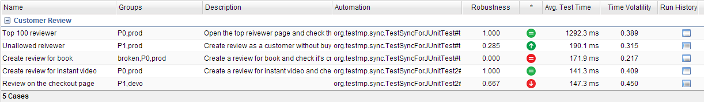
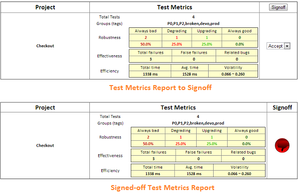

# Setup #
Once downloaded, unpack the compressed folder to see the structure of (the compiled) TestMP. You'll see a structure like this:

	testmp/
	|-- bin/      # contains the scripts for startup & maintenace.
	|-- conf/     # contains the configuration file.
	|-- data/     # contains the database files.
	|-- lib/      # contains the TestMP client libraries. 
	|-- log/      # contains the generated log files.
	|-- webapp/   # contains the wars of WebConsole and DataStore.
    |-- README.md

It's not forced but recommended that you set the TESTMP_HOME environment variable, of which the value is the path to the *testmp/*, if you hope to launch TestMP outside such directory.

Before running TestMP, you also need to have Java Runtime Environment (Version 6 or the above) installed, and make sure the JAVA_HOME is set correctly.

# Configuration #
You will find most TestMP configurations in the *conf/testmp.properties*:

	# The launching url of the DataStore each for test case, data, and environment.
	testCaseStoreUrl=http://localhost:10081/DataStore.do
	testDataStoreUrl=http://localhost:10082/DataStore.do
	testEnvStoreUrl=http://localhost:10083/DataStore.do

	# The number of threads for concurrently running task.
	executionThreadNum=10
	# The timeout for task execution. 0 means no timeout.
	executionTimeout=0

	# The time gap (in seconds) between two refreshings of the task schedule.
	scheduleRefreshingTimeGap=1800
	# The maximum latency (in seconds) to trigger a scheduled task, or ignore it.
	taskTriggerMaxLatency=600

	# The default recipient list and subject of the test metrics report. 
	testMetricsReportRecipients=
	testMetricsReportSubject=

	# The default recipient list and subject of the test env status report.
	envStatusReportRecipients=
	envStatusReportSubject=

	# The default SMTP settings to sending the report.
	smtpSettingHost=
	smtpSettingPort=25
	smtpSettingUser=
	smtpSettingPass=
	smtpSettingSTARTTLS=true

While most settings can be left to its default value, *testCaseStoreUrl*, *testDataUrl*, *testEnvUrl* may need to be modified if the default listening ports have been occupied or they are launched remotely.

It's also possible to make these urls the same to share only one datastore. But in practice it will not be efficient and may cause confusion.

The settings of *\*ReportRecipients*, *\*ReportSubject*, and *smtpSetting\** are for your convenience. You can always input/modify them manually on the TestMP Web Console.

# Launch the TestMP #
Now we're ready to startup the TestMP!

* On Windows

		cd TESTMP_HOME/bin
		startup.bat [port]

* On Linux / Mac

		cd TESTMP_HOME/bin
		./startup.sh [port]

The argument *port* is optional. If it is not given, the Web Console will defaultly use 10080 as the listening port. Then you may see the output like this:

	launching testCaseStore on 10081
	launching testDataStore on 10082
	launching testEnvStore on 10083
	launching TestMP web console on 10080
	...
	2013-07-04 14:26:55.634:INFO:oejs.AbstractConnector:Started SelectChannelConnector@0.0.0.0:10080

which meanse the datastores for test case, data, and environment, and the web console are successfully and fully launched.

Open your favorite browser, enter "http://yourhost:10080" in the address bar and click Go. You see the the welcome page on the TestMP Web Console? Congratulations!

# Automation on TestMP #

## Bind Automation Test Cases to TestMP ##

By binding automation test cases to TestMP, the test case document can be instantly updated and shown on the TestMP Web Console each time the test cases run, besides several measures as follows. 

**Test Measures**:
>
> *robustness* - a score between [0.0 - 1.0] that reflects the quality robustness of the function covered by this test case.
> 
> *robustness trend* - the trend of the robustness change: always good, always bad, upgrading, or degrading.
> 
> *average test time* - the average time consumed by running a test case, which is evaluated from its run history.
> 
> *test time volatility* - a score reflecting the run stabilty of test case. The higher volatility, the lower stability.

And the test run will also be recorded in the run history (a queue of which the capacity can be configured) for future reference.

To bind automation test cases to TestMP, you need to put *lib/testsync-[version].jar* on the class path of your automation test.

TestMP currently supports binding to TestNG or JUnit tests. For JUnit test, at least junit version 4.9 is required, and please make the test case or its parent inherited from *TestSyncForJUnit*; For TestNG test, 
no additional step is needed.

The two code snippets below show examples about how to add document to test case with Annotation *@TestDoc*:

* TestNG

		public class TestSyncForTestNGTest {

			@Test(groups = { "P0", "sanity test" })
			@TestDoc(
				project = "project name", 
				name = "test case name", 
				description = "test case description")
			public void testSomething() {
				// test steps
			}
		}

* JUnit

		public class TestSyncForJUnitTest extends TestSyncForJUnit {

			@TestDoc(
				project = "project name", 
				name = "test case name", 
				description = "test case description", 
				groups = { "P0", "prod" })
			@Test
			public void testSomething() throws Exception {
				// test steps
			}
		}

*@TestDoc* has four attributes, of which the meaning is intuitive, and all of them are not required:

>*project* defaults to the simple class name of the test case.

>*name* defaults to the the test method name.

>*description* defaults to be empty.

>*groups* defaults to be empty.

	For TestNG, the groups attribute in its @Test annotation can be automatically found and merged to @TestDoc

Pass the JVM arguments below when running the test (according to how you run the automation):

>*testCaseStoreUrl* - specify the datastore of test case.

>*updateTestDocument* - whether to automatically update the test document.

>*updateTestMeasures* - whether to automatically update the test measures.

>*runHistoryCapacity* - the fixed length of the queue contains test run records.

Example:

	-DupdateTestDocument=true -DupdateTestMeasures=true -DtestCaseStoreUrl=http://54.87.13.39:10081/DataStore.do

Only *testCaseStoreUrl* is required, whose value should refer to the same setting in the *conf/testmp.properties*, and you may need to replace its host name with the remote accessing address if it's specified as "localhost".

*updateTestDocument* and *updateTestMeasures* default to **false** to avoid unintended updates, like when debuging the test case. *runHistoryCapacity* defaults to **30**.

Then after the test run completes, you should be able to find the corresponding record on the TestMP WebConsole, like below:

## Create, Signoff and Send Test Metrics Report ##

Open the TestMP Web Console, and select the "Test Case" tab. By clicking the *Filter* button, and specifying the conditions, you can filter out the test cases that to be included in the test metrics report. Otherwise all the test cases shown on the page will be evaluated.

Clicking the *Report* button will generate the test metrics report waiting for signoff, which includes metrics for each project as follows:

> *Total Tests* - the number of test cases selected from this project.
>
> *Groups (tags)* - the number different groups involved in this test.
> 
> *Robustness* - the distribution of different quality robustness status that is evaluated from the test case's run history.
> 
> *Effectiveness* - reflecting whether the test is effective to find real bugs and minimize the number of false alarmings.
> 
> *Efficiency* - reflecting whether the test ran fast and stably enough.

You mark each project as "Accept" or "Refuse" based on the metrics, and click the *Signoff* button to get the final report. Now it's ready to send the report to the stakeholders.

Click the *Send* button at the bottom of the report, and you'll see the "Send Report" window. To save the effort of filling the Email and SMTP fields again and again, you can set the default input in *conf/testmp.properties*.

## Integrate Automation with Test Data Service ##

TBD

## Task-driven Test Environment Management  ##

TBD